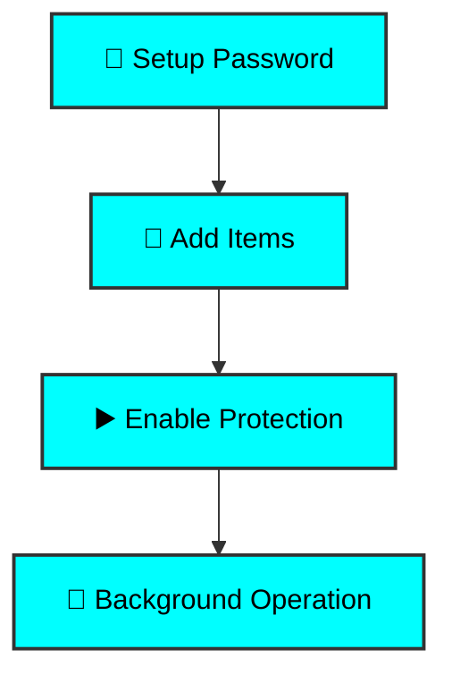
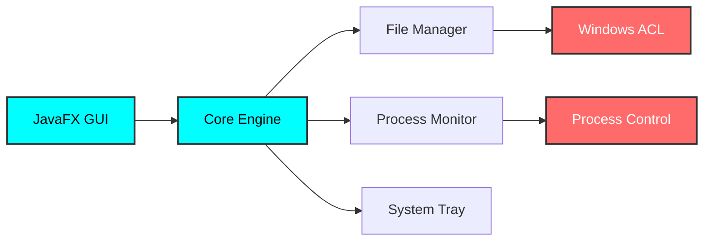

# 👻 GhostSecure

> **Desktop Security Application for File & Program Protection**
> 
> 🔐 File Locking | 🛡️ Program Blocking | 🕵️ System Tray | 💻 Desktop App

---

## 🎯 What is GhostSecure?

> **GhostSecure** is a powerful desktop security application built with **JavaFX** that allows you to protect your sensitive files, folders, and programs with password-protected access control. The application runs silently in your system tray, providing continuous protection while staying out of your way.

### ✨ Core Features

| Feature | Description |
|---------|-------------|
| **🔒 File & Folder Locking** | Lock any file or folder on your system using Windows ACL permissions. Protected items become completely inaccessible until unlocked. |
| **🚫 Program Blocking** | Block specific executable files from running. The application automatically terminates blocked programs when they attempt to start. |
| **🔐 Password Protection** | Secure your protection settings with SHA-256 hashed passwords. All configuration changes require authentication. |
| **🌟 System Tray Integration** | Runs quietly in your system tray with convenient controls for starting/stopping protection and accessing the GUI. |

## ⚙️ How It Works



| Step | Action | Description |
|------|--------|-------------|
| **1️⃣** | **Setup Password** | First launch prompts you to create a master password |
| **2️⃣** | **Add Items** | Select files, folders, or programs to protect using the GUI |
| **3️⃣** | **Enable Protection** | Start the locking service to activate protection |
| **3️⃣** | **Disable Protection** | Stop the locking service to deactivate protection (Single Folder/Program protection disabling is avalible)|
| **4️⃣** | **Background Operation** | Application minimizes to system tray and runs silently |
| **4️⃣** | **Auto Updating** | Application check with an API to verify the current version if a newer release is out it autoupdates. |

## ✨ Key Features

<div align="center">

### 🔐 **Advanced Security Suite**

</div>

| Feature | Description | Technology |
|---------|-------------|------------|
| **🔐 Advanced File Protection** | Uses Windows Access Control Lists (ACL) to deny all permissions to protected files and folders, making them completely inaccessible. | `Windows ACL` |
| **🎯 Real-time Program Blocking** | Continuously monitors running processes and automatically terminates any blocked executables within seconds of launch. | `Process Management` |
| **👤 Individual Item Control** | Toggle protection on/off for individual files, folders, or programs without affecting others in your protection list. | `Granular Control` |
| **🌊 Recursive Folder Protection** | When locking folders, all subfolders and files are automatically protected with proper permission management. | `Recursive ACL` |
| **📊 Easy Management Interface** | Intuitive JavaFX GUI with separate tables for managing protected folders and programs with checkbox selection. | `JavaFX GUI` |
| **🔄 System Tray Controls** | Start/stop protection, open GUI, or exit application directly from the system tray without opening the main window. | `System Integration` |

---

## 🛠️ Technical Details

<div align="center">

### 🔧 **Built With Modern Technologies**

</div>

```yaml
Tech Stack:
  Language: Java
  UI Framework: JavaFX
  Data Format: GSON
  Security: Windows ACL
  Integration: System Tray API
  Monitoring: Process Management
```

<div align="center">

### 📊 **Architecture Overview**



</div>

---

## 🔒 Security & Safety

<div align="center">

> ### ⚠️ **CRITICAL SECURITY NOTICE** ⚠️
> 
> **This application modifies Windows file permissions and terminates processes.**
> **This app does not ask for your password  if you want to open a folder or app you have to manually disable its protection in the gui.**
> **Always ensure you understand the implications before use.**

</div>

### 🛡️ **Security Features**

| Component | Implementation | Security Level |
|-----------|---------------|----------------|
| **🔐 Password Security** | SHA-256 hashed passwords stored securely. Authentication required for all sensitive operations. |  |
| **🛡️ Permission Management** | Uses Windows native ACL system to control file access. Protected items restored to normal permissions when unlocked. |  |
| **📝 Activity Logging** | Comprehensive logging system tracks all protection activities, configuration changes, and system events. |  |

### 🔍 **Security Audit Trail**

```bash
# Example log entries
[2024-06-08 14:30:15] INFO  - Protection service started
[2024-06-08 14:30:16] DEBUG - Monitoring 5 protected items
[2024-06-08 14:30:45] WARN  - Blocked execution: notepad.exe
[2024-06-08 14:31:12] INFO  - File protection enabled: C:\sensitive\
```

---

## 📥 Download & Installation

<div align="center">

### 🚀 **Get Started in Minutes**

</div>

**GhostSecure** is a standalone desktop application built in java for Windows, Download the installer for easier setup, or join our discord for manual installation instructions.:
### **Instilation**
**[📦 Download The Installer](https://ghosthacks96.me/downloads/GhostSecureInstaller.exe)**


<div align="center">

### 💾 **Download Options**

| Version | Size | Platform | Status |
|---------|------|----------|---------|
|  | `~15MB` | Windows |  |

---

**[📦 Download Latest Release](https://github.com/ghosthacks96/ghostsecure/releases)** | **[💻 View Source Code](https://github.com/ghosthacks96/ghostsecure)**

</div>

---

## ⚖️ License & Disclaimer

<div align="center">

### 📜 **Legal Information**

</div>

> **⚠️ Usage Disclaimer:** GhostSecure is intended for **legitimate security and privacy purposes only**. Users are responsible for complying with all applicable laws and regulations. The developers are not responsible for any misuse of this software.

> **🔧 Technical Disclaimer:** This application modifies **system-level file permissions** and **process management**. Always test in a safe environment and ensure you have proper backups before use.

> **💬 Support:** This is an **open-source project**. Community support and contributions are welcome through the project repository.

### 🤝 **Community & Support**

| Resource | Description | Link |
|----------|-------------|------|
| **🐛 Report Issues** | Bug reports and feature requests | [GitHub Issues](/issues) |
| **💬 Community** | Discord server for discussions | [Join Discord](https://discord.gg/Pn5U4whfnd) |

---

<div align="center">

### 👨‍💻 **Made by GhostHacks96**

**Desktop Security Application** | **Open Source** | **Community Driven**


---

**🌟 Star this project if you find it useful!**

</div>
